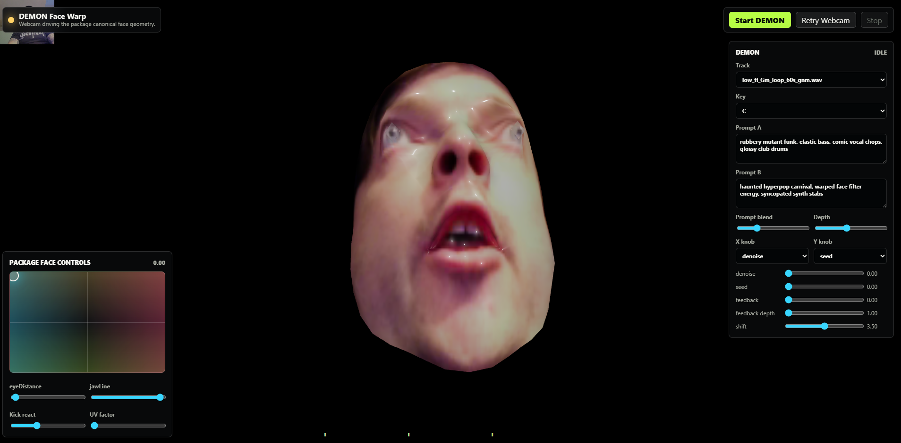

# DEMON Face Warp

Webcam-driven face warp static demo for DEMON, built around `three-mediapipe-rig` and the MediaPipe canonical face mesh.



## Run

From the DEMON repo:

```powershell
uv run python -u -m demos.realtime_motion_graph_web.run --demo C:\_dev\projects\demos\face-warp
```

Then open the web UI printed by the server.

## Notes

- Uses webcam input only.
- Uses `three-mediapipe-rig` via ESM.
- Uses the copied MediaPipe canonical face GLB and `bindGeometry`.
- `eyeDistance` and `jawLine` set the resting position of the control dot.
- The reactivity controls move that dot around the XY pad in time with the music:
  `Strength` (how far it travels), `Division` (quarter / half / bar / 2 bar),
  `Method` (random / circular / sine), and `Mode` (discrete snaps vs continuous glides).
  The dot drives both the face warp and the mapped DEMON X/Y knobs.
- `UV factor` overlays the canonical UV guide, with zero clamped off.
