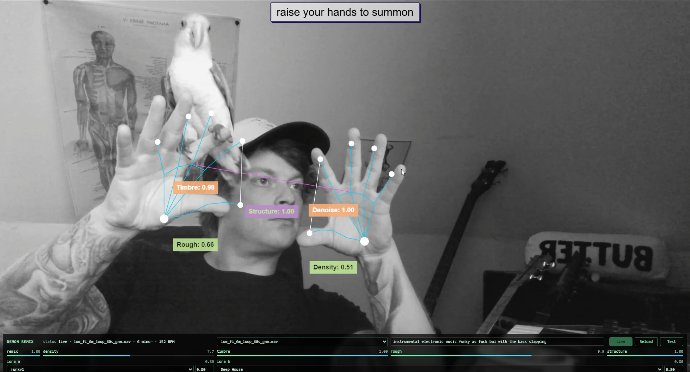

# DEMON Summon Frontend

A standalone static [DEMON](https://github.com/daydreamlive/DEMON) demo that
uses MediaPipe hand tracking as a control surface for a live DEMON remix
session.



The app is served by [DEMON](https://github.com/daydreamlive/DEMON) as static
files only. It has no build step and does not vendor DEMON client code; browser
code imports the shared SDK from `/sdk/demon-client.js`.

## Manifest

`demon.demo.json` declares the runtime mount:

```json
{
  "route": "/arp",
  "entry": "index.html"
}
```

## Run

From a DEMON checkout that supports external static demos:

```powershell
uv run python -u -m demos.realtime_motion_graph_web.server --demo C:\_dev\projects\demos\demon-summon-frontend
```

Or through the DEMON launcher:

```powershell
uv run python -u -m demos.realtime_motion_graph_web.run --demo C:\_dev\projects\demos\demon-summon-frontend
```

Open `http://localhost:1318/arp/` when running the backend directly.
With the launcher, open the URL it prints for the web UI; the external
demo still mounts on the backend origin at `/arp/`. The backend also
prints a direct `Static demo: .../arp/` link at startup.

The older backend-forwarding form also works:

```powershell
uv run python -u -m demos.realtime_motion_graph_web.run -- --demo C:\_dev\projects\demos\demon-summon-frontend
```

## Dependencies

There is no install or build step for this repo. DEMON serves these files
as static assets and does not install or execute demo dependencies.

Browser dependencies load at runtime:

- DEMON browser SDK from `/sdk/demon-client.js`
- Three.js and Tone.js from `esm.sh`
- MediaPipe wasm/model assets from their public CDN/storage URLs

## Controls

- Hand 1 pinch: remix amount (`denoise`)
- Hand 1 height: density steering
- Hand 2 pinch: timbre strength
- Hand 2 height: roughness steering
- Close hands: more structure adherence
- Hands apart: less structure adherence
- LoRA A/B: manual bottom-bar selectors with strength sliders, defaulting to
  Ambient and Deep House at `0.8` each

Use **Test (no camera)** after starting a session to sweep the same DEMON
knobs without camera input.

## Credits

Small credit: the hand-tracking visual interaction is adapted from Colliding
Scopes' [arpeggiator](https://github.com/collidingScopes/arpeggiator).
