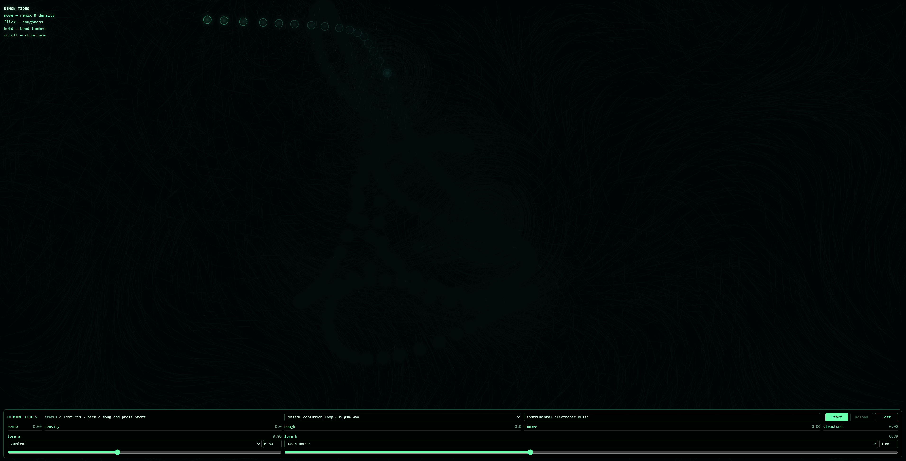

# DEMON TIDES

A standalone static [DEMON](https://github.com/daydreamlive/DEMON) demo. The
whole screen is a flow-field visualizer that doubles as an XY control surface:
move the pointer to steer a live DEMON remix while a particle current reacts to
the actual audio output.



The app is served by DEMON as static files only. It has no build step and does
not vendor DEMON client code; browser code imports the shared SDK from
`/sdk/demon-client.js`. There are **no CDN dependencies** — the visualizer is
plain `<canvas>`.

## Manifest

`demon.demo.json` declares the runtime mount:

```json
{
  "route": "/tides",
  "entry": "index.html"
}
```

## Run

From a DEMON checkout that supports external static demos:

```powershell
uv run python -u -m demos.realtime_motion_graph_web.run --demo C:\_dev\projects\demos\demon-tides-frontend
```

Or run the backend directly and open `http://localhost:1318/tides/`:

```powershell
uv run python -u -m demos.realtime_motion_graph_web.server --demo C:\_dev\projects\demos\demon-tides-frontend
```

The backend prints a direct `Static demo: .../tides/` link at startup. Pick a
song in the bottom panel and press **Start**.

## Controls

The pointer is the instrument; the bottom panel is conventional UI.

- **Move** — pointer X is remix amount (`denoise`); pointer height is density
  steering (`steer_density`).
- **Flick** — pointer speed drives roughness steering (`steer_rough`); fast
  motion is grittier.
- **Hold** (press and hold) — bends timbre strength up while held
  (`timbre_strength`), easing back to a baseline on release.
- **Scroll** — accumulates structure adherence (`hint_strength`); scroll up for
  a tighter cover, down to let the model drift.
- **Prompt** — editable mid-session (commit with Enter or blur).
- **LoRA A/B** — bottom-bar selectors with strength sliders, defaulting to
  Ambient and Deep House at `0.8` each.

Use **Test** after starting a session to sweep the same DEMON knobs without a
pointer.

## How it works

`demon-bridge.js` opens a plain DEMON remix session on a server-side fixture
(the standard PCM-upload handshake with `use_server_fixture`, `sde:false` so the
live cover knob is `denoise`) and pushes the smoothed knob targets every 80 ms.
There is no real-time audio input — DEMON renders every sound.

`field.js` owns all pointer input and rendering. It exposes `window.__tidesField`
(`pointer`, `structure`) that the bridge reads each tick, mirroring the summon
demo's game/bridge split. The bridge injects an `audioProvider`: a passive
`AnalyserNode` tap on the player's output node so the field's energy, bloom, and
color temperature track the live music (bass hits fire a pulse, also exposed to
CSS as `--bloom` for the panel glow).

## Dependencies

There is no install or build step. DEMON serves these files as static assets.
The only runtime dependency is the DEMON browser SDK at `/sdk/demon-client.js`
(plus its worker/worklet siblings), mounted by the backend.

## Credits

Built on [DEMON](https://github.com/daydreamlive/DEMON) / ACE-Step.
