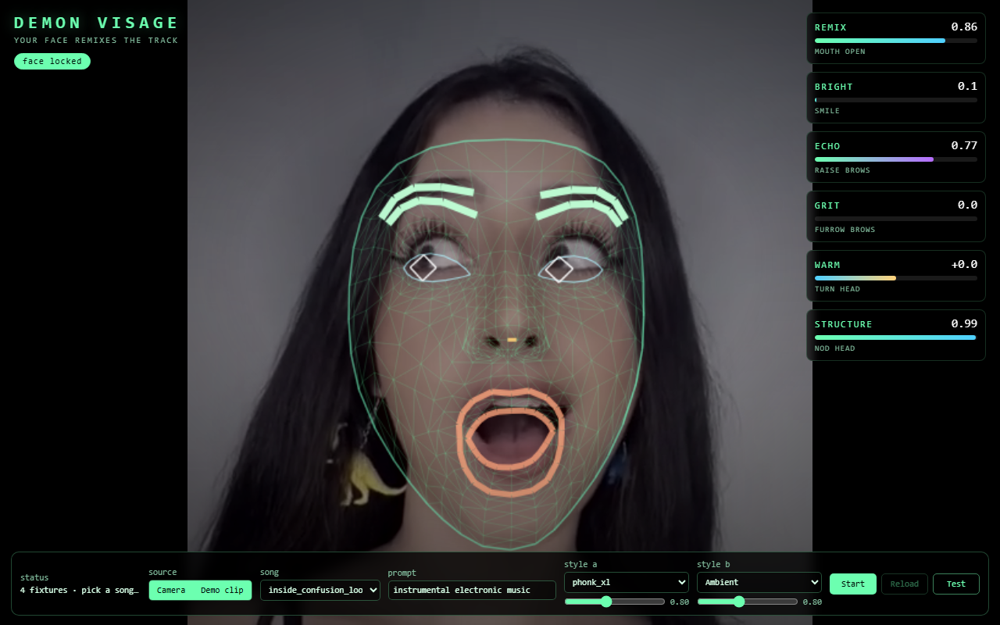

# DEMON Visage

A standalone static [DEMON](https://github.com/daydreamlive/DEMON) demo that
turns your **face** into the control surface for a live DEMON remix. MediaPipe
FaceLandmarker tracks 478 landmarks and 52 expression blendshapes; six facial
movements are mapped straight onto DEMON remix knobs, so the model re-imagines
the input song in real time as you move.



The app is served by DEMON as static files only. It has no build step and does
not vendor DEMON client code; browser code imports the shared SDK from
`/sdk/demon-client.js`.

## Manifest

`demon.demo.json` declares the runtime mount:

```json
{
  "route": "/visage",
  "entry": "index.html"
}
```

## Run

From a DEMON checkout that supports external static demos:

```powershell
uv run python -u -m demos.realtime_motion_graph_web.run --demo C:\_dev\projects\demon-example-apps\apps\visage
```

Open the URL the launcher prints. The backend also prints a direct
`Static demo: .../visage/` link at startup. To bring the page up without a GPU
(UI, tracking, and overlays only — no audio), run the backend directly in
UI-only mode:

```powershell
uv run python -u -m demos.realtime_motion_graph_web.server --no-backend --demo C:\_dev\projects\demon-example-apps\apps\visage
# then open http://localhost:1318/visage/
```

## Controls

Each driver has a live meter (top-right) labelled with the movement that drives
it:

| Face movement      | Blendshape / pose | DEMON knob      | Effect              |
| ------------------ | ----------------- | --------------- | ------------------- |
| Open your mouth    | `jawOpen`         | `denoise`       | REMIX amount        |
| Smile              | `mouthSmile`      | `steer_bright`  | BRIGHTNESS          |
| Raise your brows   | `browInnerUp`     | `feedback`      | ECHO / wash         |
| Furrow your brows  | `browDown`        | `steer_rough`   | GRIT                |
| Turn your head     | head yaw          | `steer_warm`    | WARMTH (bipolar)    |
| Nod your head      | head pitch        | `hint_strength` | STRUCTURE lock      |

- **Source** — toggle between the live **Camera** and the bundled **Demo clip**
  (`assets/d10.mp4`). If no camera is available the app falls back to the demo
  clip automatically.
- **Song** — the server-side input fixture DEMON remixes.
- **Prompt** — genre/style text, editable mid-session.
- **Style A / B** — two LoRAs with strength sliders (default Phonk + Lo-Fi).
- **Test** — sweeps synthetic expressions through the exact same mapping so the
  whole pipeline animates without a camera.

The face only steers the model; DEMON renders every sound. Values are smoothed
and the last reading is held when your face leaves frame, so a control never
snaps to zero.

## Dependencies

No install or build step. DEMON serves these files as static assets. Browser
dependencies load at runtime:

- DEMON browser SDK from `/sdk/demon-client.js`
- MediaPipe `tasks-vision` (FaceLandmarker) wasm/model from the public CDN

## Headless verification

Like the other example apps, the mapping is exposed for headless testing
without a GPU or camera:

- `window.__faceTracker` — live tracker state (`faceVisible`, `blend`,
  `landmarks`, `pose`).
- `window.__demonFaceTest` — the pure helpers (`readFace`, `mapFace`, `remap`,
  `bipolar`), the live `knob` / `target` state, and `feed(sensors)` to drive a
  synthetic expression through the mapping.

A driving video can be fed as a fake webcam (Chromium
`--use-file-for-fake-video-capture`) to exercise real MediaPipe tracking end to
end.

## Credits

Built on [DEMON](https://github.com/daydreamlive/DEMON) and Google
[MediaPipe Tasks Vision](https://developers.google.com/mediapipe/solutions/vision/face_landmarker).
